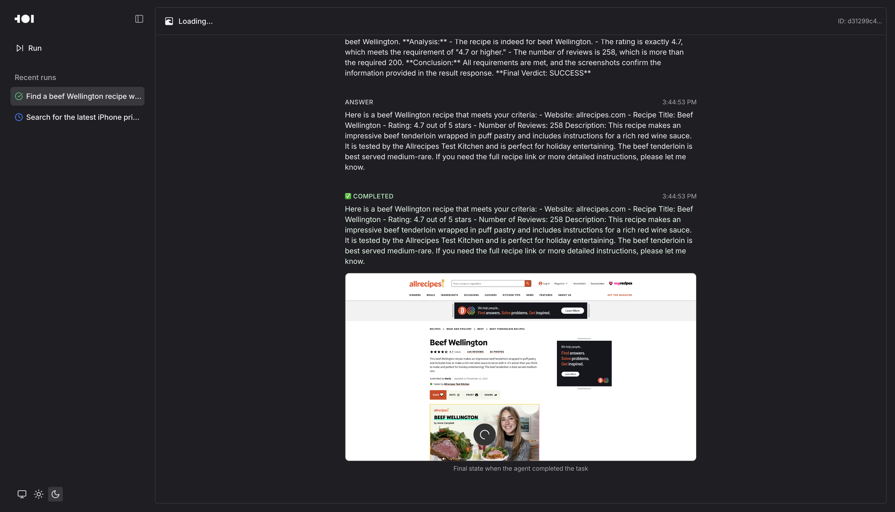

# Surfer-H-CLI / Open Surfer-H


[🌐 Website](https://www.hcompany.ai/surfer-h) |
[📖 Tech report](https://arxiv.org/abs/2506.02865) |
[🤗 Hugging-Face Models](https://huggingface.co/collections/Hcompany) |
[🏄 Surfer-H product](https://www.surferh.com/) |
[☁️ AWS Model Deployment](https://aws.amazon.com/marketplace/seller-profile?id=seller-sjve6dep3p3xc)


<div align="center">

**Introducing the latest range of Holo models: [Holo1.5](https://huggingface.co/collections/Hcompany/holo15-68c1a5736e8583a309d23d9b)**
*State-of-the-art Foundational Models for Computer Use Agents*

</div>

## Introduction

The Holo models are H Company’s Action Vision-Language Models (VLMs) and Surfer-H is the agent that enacts them in the real world. Together, they provide a powerful, automated, yet optimized solution to interacting with web interfaces the way we do—setting a goal, taking decisions, re-thinking and re-assessing where needed, and, ultimately, fulfilling everyday tasks. Holo models and Surfer-H have been designed and built to do everything from booking flights, to searching for recipes online, and more.

The Surfer-H-CLI is the command-line interface for running and controlling the Surfer-H agent, allowing you to define tasks, connect to Holo models, and execute web interactions directly from your terminal.


## Quick Start

To get started, first generate an API key at: https://portal.hcompany.ai.
*This API key will allow you to run inference on H company models. Guide: [generate an API key](https://hub.hcompany.ai/surferh/generateanapikey)*


Next, copy the example env variables.

```bash
cp .env.example .env
```

Enter your newly generated HAI_API_KEY in your .env

Or setup globally: Add these to your `.zshrc` or `.bashrc` files:
```
export HAI_API_KEY=...
export HAI_MODEL_URL=...
export HAI_MODEL_NAME=...
```


Running via the CLI:
```bash
./run-on-holo.sh
```

Running with holo1.5 as localizer (best performance):
```bash
./run-on-holo-1-5.sh
```

Running with the frontend interface:

```bash
./launch.sh
```

This command will automatically start both the Surfer-H backend and the Next.js frontend, making the web interface available at [http://localhost:3000](http://localhost:3000).


# Holo models

[Holo1](https://huggingface.co/collections/Hcompany/holo1-683dd1eece7eb077b96d0cbd) and [Holo1.5](https://huggingface.co/collections/Hcompany/holo15-68c1a5736e8583a309d23d9bd) are Action Vision-Language Models (VLMs) developed by [**H Company**](https://www.hcompany.ai/) for use in Surfer-H. The Holo models enable the agent to understand and act in digital environments. Holo is built based on 3 core components that shape and determine its behaviour: policy, localizer, and validator. These are defined below:

- **Policy**: Determines what action should be taken.
- **Localizer**: Locates elements on the screen—like buttons, text fields, or key UI attributes.
- **Validator**: Decides whether it succeeded or failed in doing what it set out to do.

Trained on a combination of open-access, synthetic, and self-generated data, Holo enables state-of-the-art (SOTA) performance on the WebVoyager benchmark, offering the best accuracy/cost tradeoff among current models. It also excels in UI localization tasks such as Screenspot, Screenspot-V2, Screenspot-Pro, GroundUI-Web, and our own newly introduced benchmark, WebClick. Holo is optimized for both accuracy and cost-efficiency, making it a strong open-source alternative to existing VLMs. Currently, these models are available for inference:

| Model                                                     | General purpose                                        | Inference Model Name |
| --------------------------------------------------------- | ------------------------------------------------------ | -------------------- |
| [Holo1 3B](https://huggingface.co/Hcompany/Holo1-3B)     | Optimized for efficiency, running locally, and hardware | holo1-3b-20250521    |
| [Holo1 7B](https://huggingface.co/Hcompany/Holo1-7B)     | Higher accuracy and for large scale inference          | holo1-7b-20250521    |
| [Holo1.5 3B](https://huggingface.co/Hcompany/Holo1.5-3B) | Enhanced efficiency with improved UI understanding     | holo1-5-3b-20250915  |
| [Holo1.5 7B](https://huggingface.co/Hcompany/Holo1.5-7B) | State-of-the-art accuracy with advanced reasoning     | holo1-5-7b-20250915  |

> **Note:** Use the **Inference Model Name** from the table above as the value for the `HAI_MODEL_NAME` environment variable when running the agent.


## Frontend Interface

In addition to the command-line interface, Surfer-H includes a modern web frontend that provides an intuitive way to interact with the agent. The frontend offers several advantages over the CLI:

### Features

- **Task Creation**: Simply describe what you want to accomplish in natural language through a web interface
- **Real-time Monitoring**: Watch your agent complete tasks with live updates
- **Trajectory Management**: View, replay, and manage automated browsing sequences
- **Settings Configuration**: Easily customize agent behavior, target URLs, and execution parameters through a UI
- **Example Tasks**: Get started quickly with pre-configured example prompts

### Interface Preview



*The Surfer-H web interface showing real-time agent monitoring as it searches for a beef Wellington recipe*

For detailed setup instructions, manual installation, and development information, see the [Frontend README](frontend/README.md).

## View a sample run
The video below shows Surfer-H in action, demonstrating how the agent completes a real-world task by thinking, reasoning, and browsing the web based on a prompt. This demo (hosted on **YouTube**) illustrates what to expect when running an agent using the Surfer-H-CLI with the command `./run-on-holo.sh.`
<p align="center"> <a href="https://www.youtube.com/watch?v=8PF9f3QPeO8" target="_blank" rel="noopener noreferrer">  </a> </p>


## Other deployment methods

There are different methods and contexts in which to deploy Holo models, including:

| Method                                                                                             | Pre-requisites                                | Notes                                                                                      |
| -------------------------------------------------------------------------------------------------- | --------------------------------------------- | ------------------------------------------------------------------------------------------ |
| [Local vLLM setup](src/surfer_h_cli/holo1/README.md)             | Install vLLM / Machine with GPU           | Uses the vLLM to download Holo1 from HuggingFace.                                                  |
| [Local Docker Container](https://github.com/hcompai/hai-cookbook/tree/main/holo1/vllm)             | Install Docker / Machine with GPU              | Uses the `vllm/vllm-openai:v0.9.1` image.                                                  |
| [Amazon SageMaker](https://github.com/hcompai/hai-cookbook/blob/main/holo1/sagemaker/deploy.ipynb) | Subscribe to Holo1 Models on AWS Marketplace | Deploys the Holo1 model via a prebuilt Notebook. No manual or complicated setup required. |

## Run the agent locally

If you're serving your own model using vLLM, start the server with:

```bash
export HAI_API_KEY=EMPTY
export HAI_MODEL_URL=http://localhost:8082/v1
export HAI_MODEL_NAME=Hcompany/Holo1-7B
vllm serve Hcompany/Holo1-7B --port 8082
```

You can then run the agent from the Surfer-H-CLI using the following command:

```bash
./run-on-holo.sh
```
Here are the different run settings that may apply based on use and context:

- ```run-on-holo.sh``` : Use a Holo mode for navigation and localization, hosted remotely.
- ```run-on-holo-local.sh``` : Script with specific instruction for using one or several locally hosted Holo1.
- ```run-on-holo-val-gpt41.sh``` : Use remotely-hosted Holo model and GPT-4.1 for validation.

When running vllm, you can leave the HAI_API_KEY empty (or set it to any value), and set HAI_MODEL_URL to http://localhost:PORT using the port where your local vllm instance is running.


The above scripts call the agent like this, with different configurations for the placeholders:

```bash
MODEL="<model name for endpoint>"
TASK="Find a beef Wellington recipe with a rating of 4.7 or higher and at least 200 reviews."
URL="https://www.allrecipes.com"

uv run src/surfer_h_cli/surferh.py \
    --task "$TASK" \
    --url "$URL" \
    --max_n_steps 30 \
    --base_url_localization https://<openai-api-compatible-endpoint-such-as-vllm> \
    --model_name_localization $MODEL \
    --temperature_localization 0.0 \
    --base_url_navigation https://<openai-api-compatible-endpoint-such-as-vllm> \
    --model_name_navigation $MODEL \
    --temperature_navigation 0.7 \

```
### Using GPT for Validation
To run ```run-on-holo-val-gpt41.sh```, remember to export your OpenAI API key for validation:
```
export API_KEY_VALIDATION=${OPENAI_API_KEY}
```
and define the correct base URL
```
--base_url_validation https://api.openai.com/v1/
```

For more information, check out the [H.AI Cookbook](https://github.com/hcompai/hai-cookbook).

## Citation

**BibTeX:**

```
@misc{andreux2025surferhmeetsholo1costefficient,
      title={Surfer-H Meets Holo1: Cost-Efficient Web Agent Powered by Open Weights},
      author={Mathieu Andreux and Breno Baldas Skuk and Hamza Benchekroun and Emilien Biré and Antoine Bonnet and Riaz Bordie and Matthias Brunel and Pierre-Louis Cedoz and Antoine Chassang and Mickaël Chen and Alexandra D. Constantinou and Antoine d'Andigné and Hubert de La Jonquière and Aurélien Delfosse and Ludovic Denoyer and Alexis Deprez and Augustin Derupti and Michael Eickenberg and Mathïs Federico and Charles Kantor and Xavier Koegler and Yann Labbé and Matthew C. H. Lee and Erwan Le Jumeau de Kergaradec and Amir Mahla and Avshalom Manevich and Adrien Maret and Charles Masson and Rafaël Maurin and Arturo Mena and Philippe Modard and Axel Moyal and Axel Nguyen Kerbel and Julien Revelle and Mats L. Richter and María Santos and Laurent Sifre and Maxime Theillard and Marc Thibault and Louis Thiry and Léo Tronchon and Nicolas Usunier and Tony Wu},
      year={2025},
      eprint={2506.02865},
      archivePrefix={arXiv},
      primaryClass={cs.AI},
      url={https://arxiv.org/abs/2506.02865},
}
```
